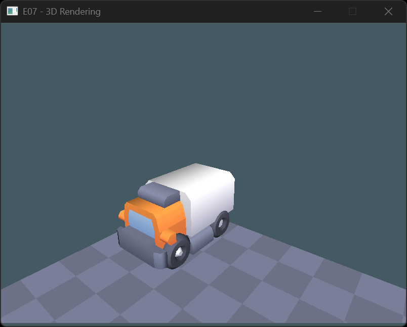

# Exercise 08 - 3D Rendering

## 08.0 Exercise review
We will take a look at the components, resources and additional functionality that take part in 3D rendering
- `Transform3D`
- `CameraComponent`
- `MeshComponent`
- `RawTexture`
- `Model3D`

## 08.1 Set up a basic scene
We will start adding a few static elements to our scene to get our bearing
- load the `floor-small-square.obj` model from the `data` folder
- in `game_reset()`, find the section where the floor is created, and let's make it a real floor
	- add a `MeshComponent` component, setting the `id_model3d` to the floor model you just loaded
	- if you start the game now, you should be seeing nothing. You will need to find the camera entity in the debug UI and set it's position to (0, 3, 0) and its rotation to (-90, 0, 0). Now you should be seeing your mesh.
	- spawn a few more in a square grid to make a proper floor (hint: I suggest you to cover at least a 4x4 area around the origin. It will make it easier to orientate yourself later)
- duplicate the setup used for the "camera" entity and rename them to "camer_debug" and "camera_gameplay"
- use the spacebar to switch between the debug and gameplay cameras

## 08.2 1st person controller
- place your gameplay camera at the origin, at an height of 1 from the floor. If you placed your floor correctly, you should see s small grid in front of you
- create a `player_controller` system and use WASD to move you character, using `glm::translate()` and `transform->local`
- change the control scheme so that A/D change your rotation on the Y axis instead, using `glm::angleAxisY()`. Does it still work as you expect? (hint: remember that matrix multiplication is non-commutative! What happens if you swap the order of operations?)
- if you have troubles figuring out what's happening, try loading a different mesh and set make it a child of the gameplay camera (don;t forget to also change your new mesh local transform so that you camera is not in the middle of it!)
- 
## 08.4 Instanced rendering (advanced)
Rendering an entire mesh for every single tile on the floor is extremely wasteful. If we could write a custom shader we could just tile the texture and get away with a single quad, but we cannot.
The next best thing is insntanced rendering: we can send all the relevant data to render a single tile to the GPU exaclty once, and then pass it all the transforms, to save a lot of time.
Check the `itu_sys_render3d_model3d_render_instanced()` function and use it to make the floor rendering more efficient.

## 08.5 Submesh rendering (advanced)
Usually, 3D moedels are not saved as a single monolithic mesh, but as a collection of submeshes. If you look inside the `Model3D` resource data, you will see that it actually kees track of how many submeshes are are present, and which indices belong to which submesh.
Create a `SubMeshComponent`, which allows selection of which submesh to render, and a version of `itu_sys_render3d_model3d_render()` that only passes the relevant indices.